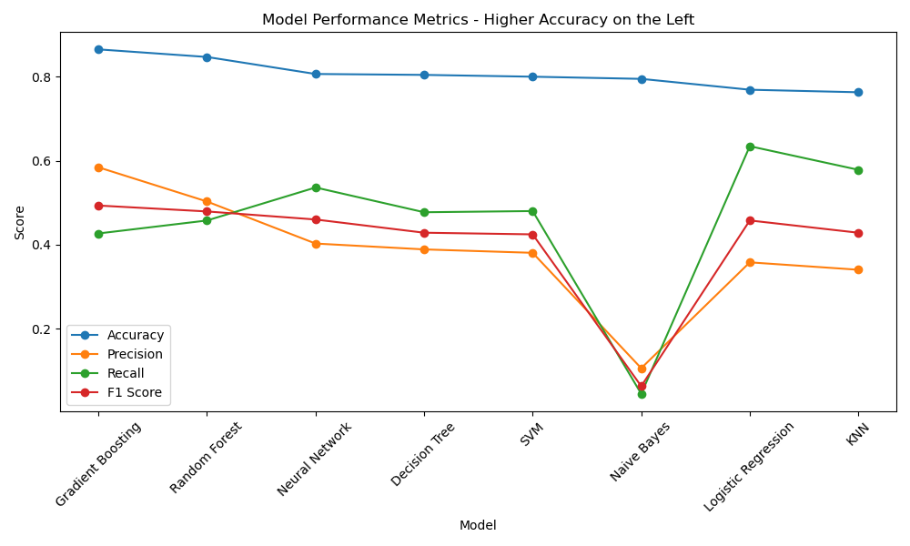
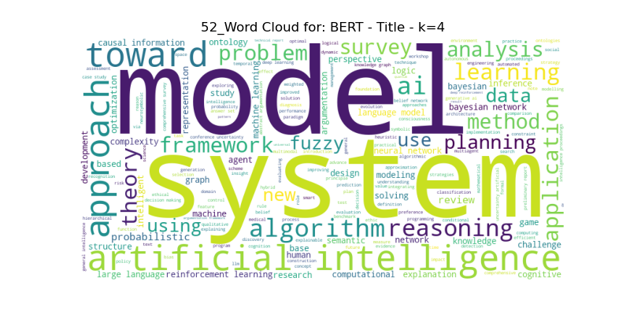
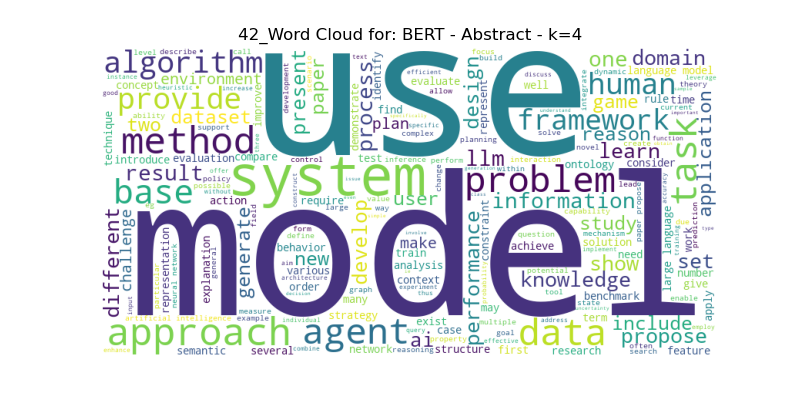
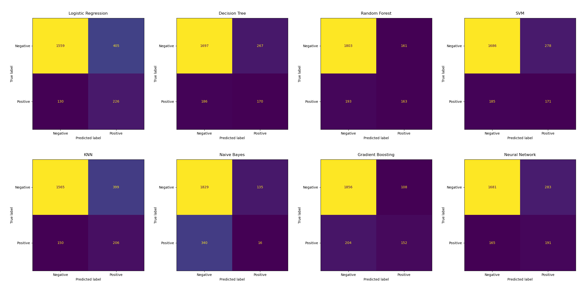

# Predicting the Probability of an ArXiv.org Research Paper Being Published in a Peer-Reviewed Journal

**Author**: Fernando Nimer, PhD

**Date**: May 14 2025

---

## Overview

This project predicts whether a research paper on [arXiv.org](https://arxiv.org/) will be published in a peer-reviewed journal. By leveraging machine learning techniques, this prediction helps researchers identify high-quality papers to prioritize for their reading.

The target variable is a binary response (`y`):

- **1**: The paper is published.
- **0**: The paper is not published.

---

## Problem Statement

Not all papers on arXiv.org are published in peer-reviewed journals. Published papers are often considered higher quality due to the rigorous review process. By predicting publication likelihood, this project can:

- Save researchers time by directing them to potentially higher-quality papers first.
- Improve the efficiency of literature reviews for academic purposes.
- Note: the project assumes that publication and high quality are correlated, which is not necessarily true in all situations.
- Note: for more details, read the detailed final report in the folder [Final Report](./final_report/).*

---

## Model Purpose and Outcomes

The model predicts the likelihood that a research paper posted on [arXiv.org](https://arxiv.org/) will eventually be published in a peer-reviewed journal.
It helps researchers identify which papers are more likely to be of higher quality, allowing them to prioritize their reading or refine their own submissions.
The model analyzes features like keywords in the title and abstract, author history, size of the paper, and other features to make its predictions.
Using advanced techniques, the best model achieved an accuracy of 87%, meaning it correctly predicts the publication status for most cases
Remember that publication is only a proxy for quality, and the model’s predictions should be used as a helpful guide rather than an absolute measure.

---

## Recommendations for Stakeholders

Researchers seeking to increase the probability of having their research papers published in a relevant vehicle should do the following:

**1. Look for the characteristics of peers who succeeded in publishing papers to search for other peers with papers published or not.** They may have demonstrated the “right behaviors” for having a “good” paper, therefore it is worth reading papers that show similar characteristics. This is also valid for peers seeking to improve the probability of having their papers published. See below for the description of the key characteristics.*

**2. Optimize the keywords used in the “title” and “abstract” of your paper.** Title and abstract keywords used in the paper were relevant predictors of the publication success.

**3. The number of pages and figures of your article matters.** The number of pages and figures are higher predictors of the probability of a paper being published. Intuitively, smaller papers have more chance to find the “space” in the research vehicles, and people tend to prefer short, precise content to read.

**4. Contact your peers who have already succeeded in publishing various papers and learn their ways. Read their papers to understand their practices.** Authors with higher success rates in publishing papers may detain unique tips and tricks to help succeed in a publication. Our models showed that the frequency of publication by a single author is a high predictor of success. Learning from other’s experiences is a must-do. Reading papers (published or not) that follow this pattern – that is, demonstrate similar characteristics of the successfully published papers – will optimize the researchers time.

### Feature Selection Table:

These features are the most relevant for our most effective models and should be read in conjunction with my Recommendations:

| Top Models | Top Features |
| :-- | :-- |
| Gradient Boosting | Number of Pages, Submitter Frequency, Title Keyword Count, Abstract Keyword Count |
| Random Forest | Number of Pages, Number of Figures, Submitter Frequency, Comments Keyword Count |
| Neural Network | Number of Pages, Number of Figures, Submitter Frequency, Comments Keyword Count |

> *For more details, refer to the folder [Final Report](./final_report/).* and [Results](./results/).*

---

## Next Steps: Integrating the Publication Prediction Model into arXiv.org

**1. Use as a Triaging Tool:** arXiv.org could integrate the publication prediction model as a triaging tool to help users quickly identify preprints with a higher likelihood of journal publication. This would allow researchers to prioritize their reading, focusing first on papers that the model predicts are more likely to meet peer-review standards and be published.

**2. Create Filter and Ranking Criteria for Users:** the model could be embedded as a filter or ranking option within arXiv’s search and discovery user interface, like how other current recommender systems suggest relevant articles based on user interests (Netflix, Spotify, and others). For example, users could sort or filter new submissions by “predicted publication probability,” streamlining literature reviews and saving time.

**3. Provide Feedback to Authors:** authors could receive feedback and recommendations on their submissions, with the model highlighting features that increase publication likelihood-such as keyword optimization in titles and abstracts, or patterns observed in successful papers-enabling them to refine their manuscripts before journal submission.

**4. Analyze Publication Potential (Internal Triage):** arXiv.org moderators and editors could leverage the model for internal triage, flagging papers with high publication potential for further visibility, or identifying papers that may benefit from additional support or community feedback.

**5. Implement Opt-In Feature:** the integration could be piloted as an opt-in feature, ensuring transparency and allowing the community to provide feedback and suggest improvements to the paper.

---

## Data Acquisition

### Data Sources:

1. **ArXiv Metadata OAI Snapshot** ([Source](https://www.kaggle.com/datasets/Cornell-University/arxiv))
    - File: `arxiv-metadata-oai-snapshot.json`
2. **ArXiv Paper Abstracts** ([Source](https://www.kaggle.com/datasets/spsayakpaul/arxiv-paper-abstracts))
    - File: `arxi_data.csv`

*Note: before running the code, download the JSON file as stated above and add it to the /data/ folder.

### Combined Dataset Summary:

- **Rows**: 11,597 (one row per research paper).
- **Key Features**:
    - `id`: Unique identifier.
    - `title`, `abstract`: Textual content of the paper.
    - `journal-ref`: Target variable indicating publication status.
    - `categories`: Subject areas (e.g., cs.AI, math.ST), number of pages, number of figures.

---

## Data Preprocessing

### Steps Taken:

1. **Handling Missing Values**:
    - Retained `NaN` values in the `journal-ref` column as they represent "not published."
    - Removed rows missing critical fields like `title` or `abstract`.
2. **Normalizing Column Names**:
    - Standardized column names across datasets (e.g., unified variations like `comment` and `comments`).
3. **Data Cleaning**:
    - Removed duplicate rows based on the unique `id`.
    - Standardized text fields (converted to lowercase, removed special characters).
4. **Feature Engineering**:
    - Added features such as `abstract_length`, `title_word_count`, and keyword matches for AI-related terms.
    - Generated text embeddings using TF-IDF and BERT for titles and abstracts.
5. **Categorical Encoding**:
    - One-hot encoded the `categories` column to represent subject areas as binary features.
6. **Data Splitting**:
    - Split data into training (80%) and test (20%) subsets using Scikit-learn's `train_test_split`.

### Example Visualizations:

Word Cloud Using BERT for Title Column - Clusters (k=4): 

Word Cloud Using BERT for Abstract Column - Clusters (k=4): 

*Additional visualizations can be found in the [Images](./images/)*

---

## Modeling

### Techniques Used:

1. **Text Embedding Techniques**:
    - TF-IDF (`max_features=5000`) for numerical representation of text.
    - BERT embeddings (`max_length=16`) reduced to 5 dimensions using PCA.
2. **Dimensionality Reduction \& Clustering**:
    - PCA for feature selection.
    - K-Means clustering (`n_clusters=5`) to create cluster labels for abstracts and titles.
3. **Predictive Modeling Algorithms**:
The following algorithms were trained and optimized:
    - Logistic Regression
    - Decision Tree
    - KNN
    - Naive Bayes
    - Random Forest
    - Gradient Boosting
    - SVM
    - Neural Networks
4. **Hyperparameter Tuning**:
Used GridSearchCV to optimize parameters for each model.
5. **Treatment of Class Inbalance**:
Used class weighting and resampling to improve recall for the minority class.

---

## Model Evaluation

### Evaluation Metrics Summary:

| Top Models | Accuracy | Precision | Recall | F1 Score |
| :-- | :-- | :-- | :-- | :-- |
| Gradient Boosting | 87% | 58% | 43% | 49% |
| Random Forest | 85% | 50% | 46% | 48% |
| Neural Network | 81% | 40% | 54% | 46% |

### Model Results Comparison Summary:

> *For more details and additional plots with detailed performance metrics can be found results in the [Final Report](./final_report/).* and [Results](./results/).*

> *Performance Metrics for the Models:
> *

> *Confusion Matrices for the Models:
> *

---

## Appendix

### Detailed Visualizations:

> *For more details, refer to [Images](./images/).*

---
